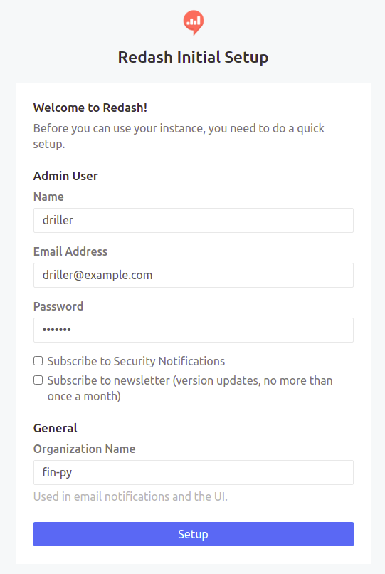
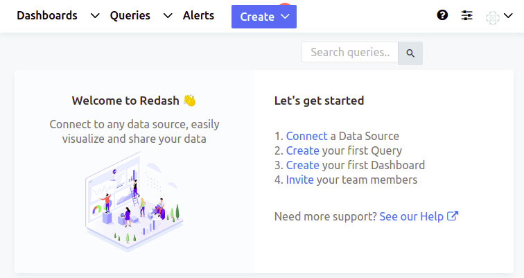
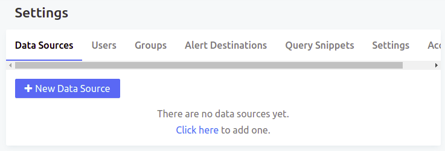
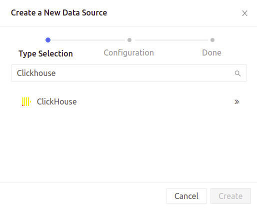
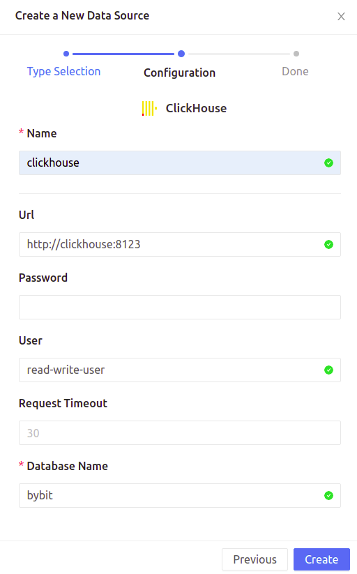
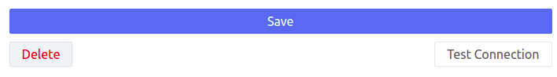

# Redashハンズオン環境

## docker-composeによる環境設定

### 起動方法

```
docker-compose -f docker-compose_redash.yml run --rm server create_db
docker-compose -f docker-compose_redash.yml up -d
```

### 停止方法

```bash
docker-compose -f docker-compose_redash.yml stop
```

### 開始方法

```bash
docker-compose -f docker-compose_redash.yml start
```

### 終了方法

```bash
docker-compose -f docker-compose_redash.yml down
```

## Redash初期設定

docker-composeが起動している状態でブラウザから `http://localhost:5000/` にアクセス



次の項目を入力して「Setup」

- Name
- Email Address
- Password
- Organization Name



「Settings」をクリック



「+New Data Source」をクリック



「Clickhouse」を選択



下記を入力して「Create」

- Name: 任意
- Url: http://clickhouse:8123
- Password: Clickhouseで設定したもの
- User: Clickhouseで設定したもの
- Database Name: bybit



「Test Connection」をクリックし、「Success」が表示されたらOK
