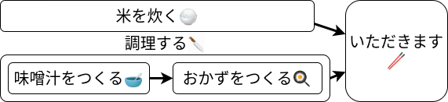

ごはんでまなぶ非同期処理 テスト
================================

- 「米を炊く」と「調理する」は同時にできる
- 「味噌汁をつくる」が終わってから「おかずをつくる」
- 「米を炊く」と「調理する」が両方おわったら「いただきます」
- test 

コード例
--------

.. literalinclude:: ./code/gohan.py
   :linenos:

出力例
------

.. literalinclude:: ./code/gohan.txt